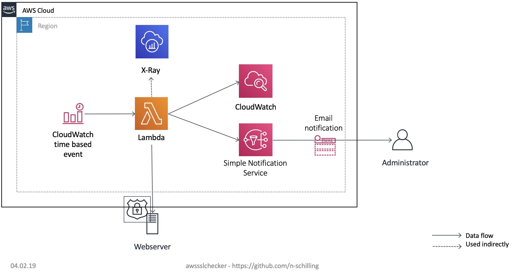

# AWS SSL Checker

AWS SSL checker can be used to monitor the expiration date of SSL certificates used for HTTP endpoints. You can configure an amount of days before the expiration date where the SSL checker alarms you via e-mail. Until then you have enough time to install a new SSL certificate in your environment.

## When to use and when not to use?

You should use this tool if you are controlling the HTTP endpoint and therefor the SSL certificate by yourself. If you are using an AWS Application load balancer or other AWS services which can make use of the AWS certificate manager you should consider using the AWS Config Rule for this topic: [See here](https://docs.aws.amazon.com/config/latest/developerguide/acm-certificate-expiration-check.html "Link to AWS Config rule")

## Base architecture



### Used AWS Services

* AWS Simple Notification Service (SNS)
* AWS Lambda
* AWS X-AWS
* AWS Cloudwatch

## Implementation guide

Please follow all the steps below to deploy the solution.

### Requirements

* Java 8 (tested with version 1.8.0_181)
* Gradle (tested with version 4.10.2)
* Node.js (tested with version 8.12.0)
* Serverless (tested with version 1.35.0)
* AWS Pseudo Parameters (install via ```npm install serverless-pseudo-parameters```)
* serverless plugin tracing (install via ```npm install serverless-plugin-tracing```)

### Deployment

1. Clone this repository
2. Edit the parameters in the serverless.yml
  * ssl_endpoint: The https endpoint which should be checked.
  * days_till_expiration: The number of days (Integer only) before the expiration of the SSL certificate when a warning message should be generated.
  * useSNS: Boolean variable if an email notification should be send if days_till_expiration is reached
  * (if useSNS is true) toEmailAddress: Email adress where the notification will be send to in case of an expired SSL certificate
3. run ```gradle build``` to build the java Application
4. run ```sls deploy``` to deploy the solution to awssslchecker
5. Confirm the SNS Subscription in your inbox

### Undeploy

1. run ```sls remove``` to remove the solution
